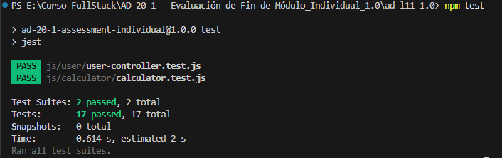

<h1 align="center">🧪 Pruebas Unitarias con Jest 🧪</h1>

## 📋 Descripción
Implementación completa de pruebas unitarias para los módulos Calculator y UserController utilizando Jest

## 🎯 Objetivos Cumplidos

### ✅ Tarea 1: Pruebas para Calculator
- **2 pruebas unitarias** para la función `divide()`
- **2 pruebas unitarias** para la función `multiply()`

### ✅ Tarea 2: Pruebas para UserController
- **1 prueba** para la función `add()` - usuario no existente
- **1 prueba** para la función `remove()` - usuario no existente  
- **2 pruebas unitarias** para la función `findByEmail()`
- **2 pruebas unitarias** para la función `findById()`

### ✅ Tarea 3: Desarrollo Orientado por Pruebas (TDD)
- **Prueba unitaria** para división por cero
- **Implementación corregida** de `divide()` con manejo de errores

## 🛠️ Tecnologías Utilizadas
- **JavaScript** (Node.js)
- **Jest** - Framework de testing

## 📁 Estructura del Proyecto
```
pruebas-unitarias-js/
├── js/
│   ├── calculator/
│   │   ├── calculator.js
│   │   └── calculator.test.js
│   ├── user/
│   │   ├── user.js
│   │   ├── user-controller.js
│   │   └── user-controller.test.js
│   └── jest.config.js
├── index.js
├── package.json
├── package-lock.json
└── README.md
```

## 🎯 Resultados de las Pruebas


